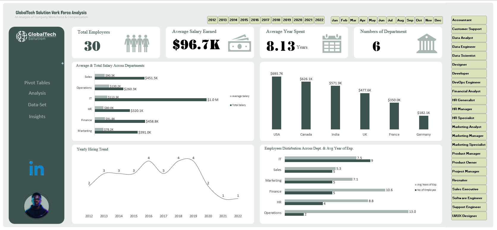

# 💼 GlobalTech Solutions — Workforce & Compensation Dashboard

This repository contains the **data, analysis, and interactive dashboard** for **GlobalTech Solutions**.  
The dashboard provides a **one-page overview** of the workforce, highlighting **headcount, compensation, experience levels, and city-based insights**.  

---

## 🧠 Questions & Insights

### 1️⃣ Employees with Over 10 Years of Experience
The following employees have served more than 10 years with the company:
- Henry Wright  
- John Brown  
- Daniel Perez  
- William Davis  
- Laura Doe  
- Emily Campbell  
- Daniel Scott  
- James Johnson  
- Sofia Mitchell  
- Alexander Hall  

---

### 2️⃣ Department with the Highest Average Years of Experience
**Operations** — average of **~13 years** of experience.  

---

### 3️⃣ Average Salary per Department

| Department | Average Salary |
|-------------|----------------|
| Operations  | **$130.2K** |
| IT          | **$113.3K** |
| Finance     | **$91.8K** |
| Sales       | **$90.3K** |
| HR          | **$80.0K** |
| Marketing   | **$78.2K** |

---

### 4️⃣ Country and City with the Largest Workforce
- **Country:** Canada 🇨🇦  
- **Cities:** Berlin, Paris, Toronto  

---

### 5️⃣ Department Distribution by Country

| Country | Department |
|----------|-------------|
| **Canada** | Finance (4), HR (1), Sales (2) |
| **India**  | Finance (1), IT (4) |
| **USA**    | HR (3), IT (2), Operations (2) |
| **France** | IT (1), Marketing (3) |
| **UK**     | IT (2), Marketing (1), Sales (2) |
| **Germany**| Marketing (1), Sales (1) |

---

### 6️⃣ Salaries vs. Years of Experience
There is a **moderate positive relationship** between salary and experience.  
However, employees’ pay also depends on their **departmental role** and not only on years of experience.

---

### 7️⃣ Top 5 Earners Across the Company

| Employee | Salary |
|-----------|--------|
| Daniel Perez | **$134.8K** |
| Daniel Scott | **$134.2K** |
| Sofia Mitchell | **$128.3K** |
| Charlotte King | **$125.7K** |
| James Johnson | **$125.5K** |

---

### 8️⃣ Department with the Highest Salary Expense
**IT Department** — total salary expense: **~$1.0M**

---

### 9️⃣ Most Common Job Title
**Developer** 👨‍💻 — the most frequent role in the company.

---

## 📊 Dashboard Overview
The Excel dashboard visualizes:
- Key Performance Indicators (Total Employees, Average Salary, Avg. Experience)
- Department & Country Headcount Distribution  
- Experience and Hiring Trends  
- Compensation Insights (Average & Total Salary per Department)  
- Retention Metrics and Top Earners  
- City-Level Salary & Workforce Insights

### 1️⃣ **Key Performance Indicators**
- **Total Employees:** 30  
- **Average Salary Earned:** $96.7K  
- **Average Years Spent:** 8.13 years  
- **Departments Analyzed:** 6

---

📂 **Deliverables**
- `GlobalTech_Dashboard.xlsx` — full Excel analysis [View the Dashboard](https://1drv.ms/x/c/1684d2727784013a/EVItwTqraXNPlh99yvrW8bMB2oUQqvPFTs1cYm4be7wEYg?e=r6dxbo)

